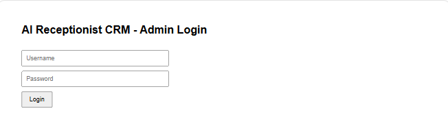
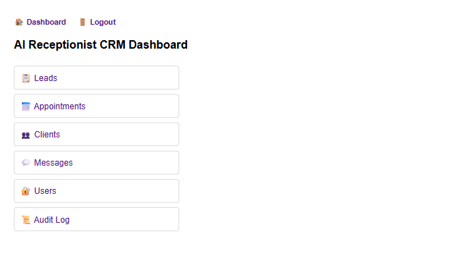
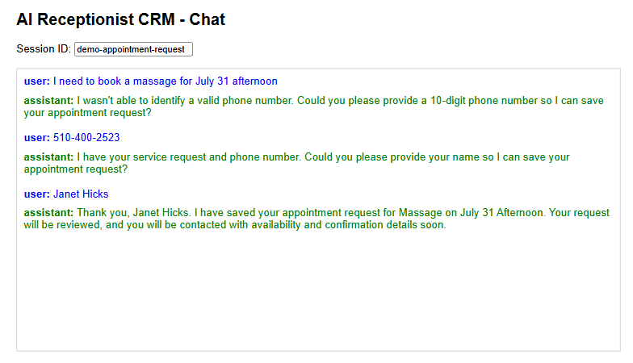
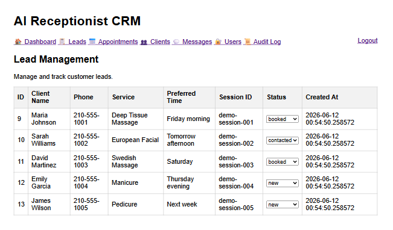
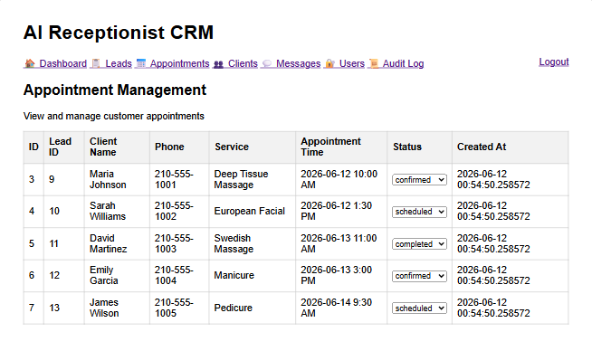
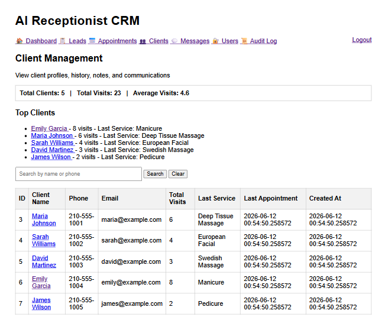
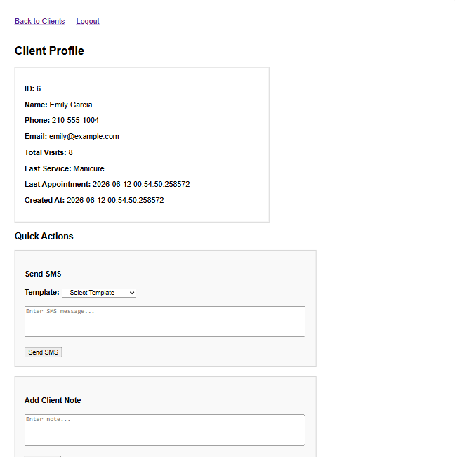
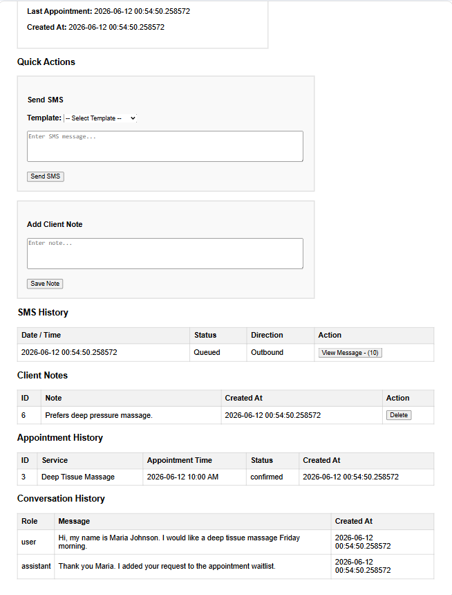
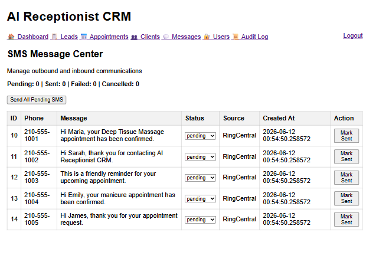

# AI Receptionist CRM Platform

A cloud-hosted customer engagement and workflow automation platform built with **FastAPI**, **PostgreSQL**, **OpenAI**, **RingCentral**, **Docker**, **GitHub Actions**, and **Microsoft Azure**.

The platform combines conversational AI, customer relationship management (CRM), appointment tracking, SMS communication, and workflow automation into a unified business application.

---

# Overview

AI Receptionist CRM transforms customer conversations into structured business workflows.

The system captures leads, manages appointments, maintains client profiles, automates SMS communication, and supports AI-assisted customer engagement through OpenAI integration.

This project serves both as a production-oriented business platform and a software engineering portfolio project focused on modern backend development, cloud deployment, testing, containerization, and AI integration.

---

# Live Demo

Azure App Service Deployment:

Demo credentials available upon request.

---

# Screenshots

## Login Page

Administrator login for AI Receptionist CRM.



---

## Dashboard

System overview and administrative dashboard.



## AI Receptionist Chat

The AI Receptionist supports multi-turn conversations, validates customer information, extracts structured business data, and automatically creates CRM records for follow-up and workflow automation.


---

## Lead Management

Track and manage customer leads generated through AI conversations and business workflows.



---

## Appointment Management

Manage appointments, scheduling status, and customer bookings.



---

## Client Management

Maintain customer records, service history, and communication details.



---

## Client Profile

Customer profile including contact information, appointments, notes, and communication history.



---

## Conversation History

Persistent conversation history supporting AI-assisted customer engagement and lead qualification workflows.



---

## SMS Message Center

View and manage customer communications through RingCentral SMS integration.



---

# Features

## CRM

* Lead Management
* Client Management
* Appointment Tracking
* Client Notes
* SMS History

## AI Receptionist

* Conversational AI
* Lead Qualification
* Service Request Capture
* Customer Engagement Workflows
* Semantic Information Extraction

## Communications

* SMS Messaging via RingCentral
* Appointment Reminders
* Follow-Up Messaging
* Message Status Tracking

## Security

* User Authentication
* Role-Based Access Control
* Password Hashing
* Audit Logging

## Platform

* Docker Container Support
* Docker Compose Support
* PostgreSQL Database
* GitHub Actions CI/CD
* Microsoft Azure Deployment

---

# Technology Stack

## Backend

* Python
* FastAPI
* PostgreSQL

## AI

* OpenAI API
* Conversational AI
* Semantic Information Extraction

## Communications

* RingCentral SMS API

## DevOps

* Docker
* Docker Compose
* GitHub Actions
* Git
* Ubuntu (WSL2)
* Microsoft Azure

## Testing

* Pytest
* Unit Testing
* Integration Testing

Run tests:

```bash
pytest
```

Generate coverage report:

```bash
pytest --cov=. --cov-report=term-missing
```

---

# Architecture

```text
Customer
    ↓
AI Receptionist
    ↓
FastAPI API Layer
    ↓
Service Layer
    ↓
PostgreSQL

External Services:
    • OpenAI API
    • RingCentral SMS

Deployment:
    • Docker
    • Docker Compose
    • Microsoft Azure App Service
```

Detailed architecture documentation:

```text
docs/architecture.md
```

---

# Automated Testing

Current status:

* 51+ automated tests
* 75% code coverage

Test categories:

* Unit Tests
* Integration Tests
* Authentication Tests
* Authorization Tests
* Service Layer Tests
* API Route Tests

---

# Project Status

Active development.

## Completed Modules

* CRM Core
* User Management
* Security & Roles
* Audit Logging
* SMS Integration
* Docker Deployment
* Azure Deployment
* GitHub Repository
* Automated Testing
* Architecture Documentation

## Current Focus

* Front-End Modernization
* React User Interface
* Reporting & Analytics
* Voice AI Integration

---

# Running Locally

## Build and Start

```bash
docker compose up --build
```

## Application URL

```text
http://127.0.0.1:8000
```

## Useful Endpoints

```text
/health
/admin/login
/admin/clients
/admin/leads
/admin/appointments
/admin/sms
```

---

# Environment Variables

Create a `.env` file containing:

```env
DATABASE_URL=your_database_url
OPENAI_API_KEY=your_openai_api_key
TEST_SMS_TO_NUMBER=your_test_phone_number
```

Additional RingCentral credentials may also be required.

---

# Key Engineering Concepts

This project demonstrates:

* REST API Design
* Layered Application Architecture
* Service-Oriented Design
* Authentication & Authorization
* Conversational AI Integration
* Semantic Information Extraction
* Workflow Automation
* Containerization with Docker
* Automated Testing
* Cloud Deployment on Microsoft Azure

---

# Roadmap

## Phase 1

* CRM Core
* AI Receptionist
* SMS Integration

## Phase 2

* Modern React Front-End
* Enhanced Reporting
* Improved Dashboard UX

## Phase 3

* Voice AI Receptionist
* Call Transcription
* Semantic Client Profiles

## Phase 4

* Multi-Location SaaS Platform
* SpaRes AI

---

# Author

**Kouider Bakhti**

Senior Software Engineer | Cloud, Distributed Systems & AI-Powered Applications

LinkedIn:
linkedin.com/in/kouiderbakhti

GitHub:
github.com/kb5321
